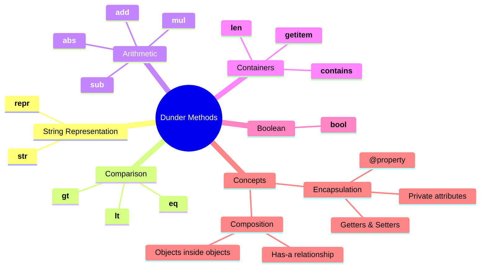

# Table of Contents

## Foundation Documentation

Read these in order before starting the exercises:

1. [Dunder Methods, Composition, Encapsulation](dunder_methods.md) — What dunders are, how they work, encapsulation with `__` and `@property`, composition patterns

---

## Practice Exercises

### Beginner

1. [temperature](../playlist/playlist.md) — `__str__`, `__eq__`, `__lt__`, `__add__`
1. [word_box](../word_box/word_box.md) — `__len__`, `__contains__`, `__str__`
1. [counter](../counter/counter.md) — `__str__`, `__eq__`, `__add__`, `__bool__`

### Intermediate

**Math & Data:**

1. [fraction](../fraction/fraction.md) — `__str__`, `__eq__`, `__lt__`, `__add__`
1. [matrix2x2](../matrix2x2/matrix2x2.md) — `__str__`, `__eq__`, `__add__`, `__getitem__`
1. [rgb_color](../rgb_color/rgb_color.md) — `__str__`, `__repr__`, `__eq__`, `__add__`, `__contains__`

**Collections:**

1. [leaderboard](../leaderboard/leaderboard.md) — `__getitem__`, `__len__`, `__contains__`, `__str__`
1. [inventory](../inventory/inventory.md) — `__len__`, `__contains__`, `__getitem__`, `__add__`, `__eq__`, `__str__`
1. [playlist](../playlist/playlist.md) — `__len__`, `__contains__`, `__getitem__`, `__add__`, `__eq__`, `__str__`

### Advanced

1. [vector](../vector/vector.md) — `__str__`, `__repr__`, `__eq__`, `__add__`, `__sub__`, `__mul__`, `__abs__`, `__lt__`, `__bool__`
